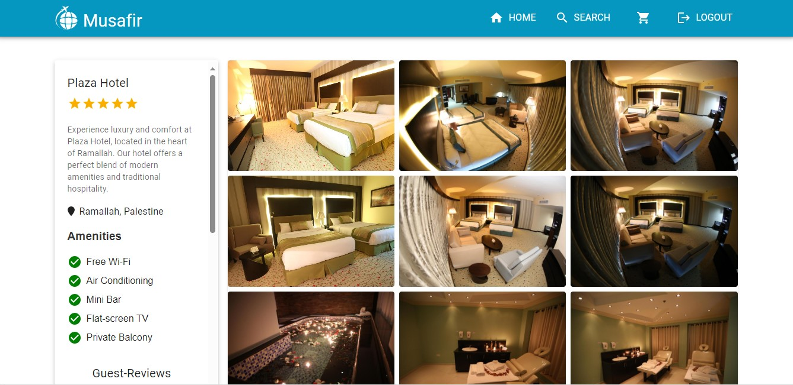

# Musafir - Travel and Accommodation Booking Platform

Welcome to **Musafir**, a platform designed for travel and accommodation booking. Musafir provides users with robust booking functionalities and administrators with an easy-to-use management interface.

## Features

### User Features:
- **Login and Authentication**: Secure access with user authentication via API.
- **Search and Filter**: Advanced search for hotels, destinations, and amenities.
- **Featured Deals**: Highlighting discounted travel options.
- **Recently Visited Hotels**: Personalized recommendations.
- **Hotel Details**: Comprehensive information about hotels, including reviews and room availability.
- **Room Booking**: Easy selection and booking of available rooms.
- **Checkout and Confirmation**: Secure booking process with detailed confirmation.

### Admin Features:
- **Admin Dashboard**: Manage cities, hotels, and rooms with ease.
- **Entity Management**: Create, update, and delete entities (Cities, Hotels, Rooms).
- **Search and Filters**: Efficient admin-side search functionality.

## Tech Stack

- **Frontend**: React, TypeScript, CSS Modules
- **State Management**: Redux (User Side) and Context API (Admin Side)
- **API Integration**: Swagger-documented backend APIs
- **Build Tool**: Vite

## API Overview

The backend APIs are documented via Swagger and provide endpoints for:
- User Authentication
- Search Functionality
- Hotel and Room Management
- Booking and Confirmation

Swagger Documentation: [API Swagger Link](https://app-hotel-reservation-webapi-uae-dev-001.azurewebsites.net/swagger/index.html)

## Directory Structure

```plaintext
Musafir/
├── README.md
├── eslint.config.js
├── index.html
├── package.json
├── tsconfig.*
├── vite.config.ts
├── public/
└── src/
    ├── App.tsx
    ├── index.css
    ├── main.tsx
    ├── api/
    ├── components/
    ├── features/
    ├── hooks/
    ├── pages/
    ├── routes/
    ├── types/
    └── utilities/
```

## 🚀 Technologies

In this project, I've utilized the following libraries:

### Core Libraries:
- **[React](https://reactjs.org/):** A JavaScript library for building user interfaces.
- **[React-DOM](https://reactjs.org/docs/react-dom.html):** Entry point of the DOM-related rendering paths.

### State Management:
- **[@reduxjs/toolkit](https://redux-toolkit.js.org/):** The official, recommended way to write Redux logic.
- **[React-Redux](https://react-redux.js.org/):** Official React bindings for Redux.
- **[Redux-Persist](https://github.com/rt2zz/redux-persist):** Persist and rehydrate a Redux store.
- **[@tanstack/react-query](https://tanstack.com/query/latest):** Powerful asynchronous state management for TypeScript/JavaScript.

### Networking:
- **[Axios](https://axios-http.com/):** Promise-based HTTP client for the browser and Node.js.

### UI & Styling:
- **[@mui/material](https://mui.com/):** Material UI components for rich UI design.
- **[@mui/icons-material](https://mui.com/material-ui/material-icons/):** Material Icons for Material UI.
- **[Lucide-React](https://lucide.dev/):** Beautiful and consistent icon toolkit.

### Forms and Validation:
- **[Formik](https://formik.org/):** Forms in React, without the tears.
- **[Yup](https://github.com/jquense/yup):** Dead-simple object schema validation.

### Routing:
- **[React-Router-DOM](https://reactrouter.com/):** DOM bindings for React Router.

### Utilities:
- **[Day.js](https://day.js.org/):** Fast 2kB alternative to Moment.js with the same modern API.
- **[JWT-Decode](https://github.com/auth0/jwt-decode):** Decode JWT tokens, mostly useful for browser applications.
- **[i18n-ISO-Countries](https://github.com/michaelwittig/node-i18n-iso-countries):** ISO country codes for i18n.

### Maps and Animations:
- **[Leaflet](https://leafletjs.com/):** An open-source JavaScript library for mobile-friendly interactive maps.
- **[React-Leaflet](https://react-leaflet.js.org/):** React components for Leaflet maps.
- **[Lottie-React](https://lottiereact.com/):** Lottie for React.

### Components:
- **[React-Slick](https://react-slick.neostack.com/):** Carousel component built with React.
- **[React-World-Flags](https://www.npmjs.com/package/react-world-flags):** React component for displaying world flags.

### Date Handling:
- **[React-Date-Range](https://github.com/hypeserver/react-date-range):** A date library agnostic date picker.

## 🌟Musafir Pages

### 1. Login Page


- Authenticate securely with username and password entry fields. 🔐

- User Login: 
  - Username: user
  - Password: user

- Admin Login: 
  - Username: admin
  - Password: admin

## User Pages

### 2. Home Page


#### 2.1 Robust Search Functionality

- Central search bar with the placeholder: "Search for hotels, cities..."
- Interactive calendar for selecting check-in and check-out dates.
- Controls for specifying the number of adults, children and rooms.

#### 2.2 Featured Deals Section

- Special offers are highlighted in the "Featured Deals" section.

#### 2.3 User's Recently Visited Hotels

- Personalized display of the last visited hotels with detailed information.

#### 2.4 Trending Destination Highlights

- A curated list of popular cities with visually appealing thumbnails.

### 3. Search Page


#### 3.1 Comprehensive Search Filters

- Sidebar with filters for price range, star rating, and amenities.

#### 3.2 Hotel Listings

- Listings of hotels matching search criteria.

### 4. Hotel Page


#### 4.1 Visual Gallery

- Fullscreen viewable high-quality images of the hotel.

#### 4.2 Detailed Hotel Information

- Hotel name, star rating, description, reviews, and map location.

#### 4.3 Room Availability and Selection

- List of room types with images, descriptions, prices, and add-to-cart options.

### 5 Checkout Page


#### 5.1 User Information and Payment

- Form for personal details and payment method.

#### 5.2 User Cart Items

- List of booked rooms with their details (room number, price, capacity and amenities).

#### 6. Confirmation Page


- Booking details with confirmation number and download confirmation details as pdf option.

### 6. Admin Page for Easy Management


#### 6.1 Functional Left Navigation

- Navigator with links to Cities, Hotels, and Rooms.

#### 6.2 Admin Search Bar

- Filters for the grids.

#### 6.3 Detailed Grids

- Detailed information and management options for Cities, Hotels, and Rooms.

#### 6.4 Create Button

- Form for creating new entities like Cities, Hotels, or Rooms.

#### 6.5 Entity Update Form


- Forms for updating information on entities within the platform.

### 6. Page Not Found


- This page is displayed whenever a user navigates to a URL that does not correspond to any active route within the application.

## 🎯 Project Scrum Board

My project is managed using an agile scrum board to track tasks and sprints.


## 💾 Installation

1. Clone the repository:
   ```bash
   git clone https://github.com/ZainaZaben/Travel-and-Accommodation-Booking-Platform.git
   ```
2. Navigate to the project directory:
   ```bash
   cd musafir
   ```
3. Install dependencies:
   ```bash
   npm install
   ```
4. Start the development server:
   ```bash
   npm run dev
   ```
5. Open `http://localhost:5173` to view the app.

## Usage

1. Configure the API base URL in `src/api/index.ts` if necessary.
2. Access the admin dashboard with proper credentials.
3. Explore features such as searching for hotels, booking rooms, and managing data as an admin.

## Scripts

- `npm run dev`: Start the development server.
- `npm run build`: Build the project for production.
- `npm run preview`: Preview the production build.

## 📬 Contact

If you have any questions or want to reach out, feel free to connect with me:

<p align="center">
  <a href="mailto:zainarami2002@gmail.com">
    
  </a>
  <a href="https://www.linkedin.com/in/zainazaben/">
    
  </a>
</p>

## 💖 Acknowledgement

I express my deepest gratitude to **Foothill Technology Solutions** for providing me with the opportunity to participate in this internship cycle. Their steadfast support has been pivotal in the successful development of this project.